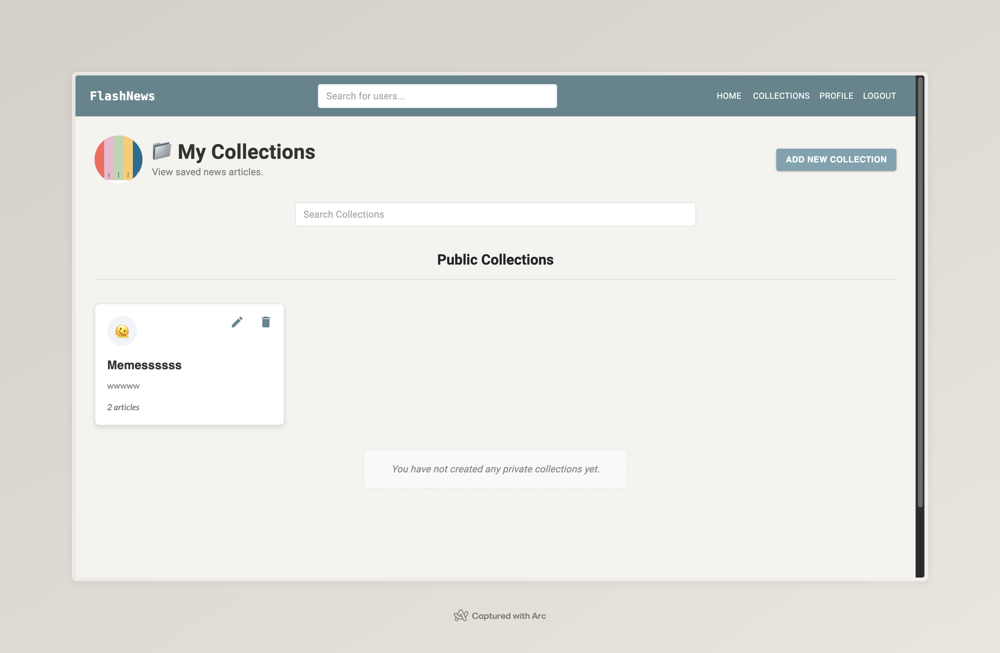

# Flash News Project

Flash News is a web application designed to allow users to share and explore news articles through a social feed. Posts on Flash News are ephemeral, disappearing after 24 hours, creating a sense of immediacy and anchoring users in the present moment. The platform provides features like collections, tags, and the ability to follow users for a more curated news-sharing experience.

Flash News addresses the issue of echo chambers and political polarity by allowing users to see the news articles their friends, peers, or public figures are consuming. This app serves as a medium for broadening perspectives by offering insight into the sources and narratives shaping others' viewpoints. It is distinct from other social media platforms as it focuses solely on news sharing without the distractions of memes, videos, or unrelated content.

The app is particularly useful for intellectually curious and politically engaged users who wish to share thought-provoking journalism or gain a mental map of the ideologies within their social circles. By fostering an environment for sharing and exploring news, Flash News aims to spark meaningful conversations both online and offline.

> The app is deployed at: https://cs162-flash-news-bdgn.vercel.app/

## Table of Contents

- [Overview](#overview)
- [File Structure](#file-structure)
  - [Backend](#backend)
  - [Frontend](#frontend)
- [Tech Stack](#tech-stack)
- [Setup Instructions](#setup-instructions)
  - [Backend Setup](#backend-setup)
  - [Frontend Setup](#frontend-setup)
- [Core Features](#core-features)
- [CI/CD Integration](#cicd-integration)
- [Demonstration](#demonstration)
- [Project Members](#project-members)
- [Contributing](#contributing)
- [License](#license)

---

## Overview

Flash News is a platform where users can:
- Share news articles with their followers.
- Organize articles into collections (public or private).
- Interact with posts via likes, comments, and tags.
- View and explore a personalized feed.

The project follows a modular structure for backend and frontend.

---

## File Structure

### Backend

The backend is written in Python using the Flask framework. It provides APIs for authentication, posts, collections, comments, and more.

```
backend/
├── app/
│   ├── __init__.py       # Flask app initialization
│   ├── auth.py           # Authentication routes and logic
│   ├── collection.py     # API for managing collections
│   ├── comment.py        # API for comments on posts
│   ├── config.py         # Configuration class for uploads
│   ├── like.py           # API for likes on posts & comments
│   ├── models.py         # Database models
│   ├── og.py             # Open Graph functionality
│   ├── post.py           # API for managing posts
│   ├── user.py           # API for user profiles and follows
│   ├── utils.py          # Helper utilities
├── tests/
│   ├── conftest.py
│   ├── test_auth.py
│   ├── test_collection.py
│   ├── test_comment.py
│   ├── test_like.py
│   ├── test_post.py
│   ├── test_user.py
├── uploads/
├── .env.example          # Example environment variables file
├── railway.json          # Railway deployment configuration
├── README.md             # Backend documentation
├── requirements.txt      # Python dependencies
```

### Frontend

The frontend is built with React and uses Material UI for styling and Chakra UI for flexibility in components.

```
frontend/
├── public/               # Static files for the React app
│   ├── favicon.ico
│   ├── index.html
│   ├── manifest.json
├── src/                  # Source code for the React app
│   ├── components/       # Reusable React components
│   │   ├── ArticleCard.js
│   │   ├── CollectionCard.js
│   │   ├── EditDeleteMenu.js
│   │   ├── Header.js
│   │   ├── MultipleSelectChip.js
│   │   ├── PostCard.js
│   │   ├── ThemedButton.js
│   │   ├── UsernameAndOPChip.js
│   ├── controllers/      # Controllers: page-specific logic
│   │   ├── CommenterContoller.js
│   │   ├── config.js
│   │   ├── PostController.js
│   │   ├── TagsController.js
│   ├── forms/            # Forms for user interactions
│   │   ├── AddCommentForm.js
│   │   ├── AddPostForm.js
│   ├── modals/           # Modals for additional UI features
│   │   ├── CollectionDetailModal.js
│   ├── pages/            # Page-level components for the app
│   │   ├── CollectionsPage.js
│   │   ├── FeedPage.js
│   │   ├── LoginPage.js
│   │   ├── PostDetailPage.js
│   │   ├── ProfilePage.js
│   │   ├── SettingsPage.js
│   │   ├── SignupPage.js
│   │   ├── WelcomePage.js
│   ├── App.js            # Main React component
│   ├── App.css           # Global styles
│   ├── index.js          # Entry point for the app
├── package.json          # Project dependencies
├── README.md             # Frontend documentation
```

---

## Tech Stack

<h3 align="left">Languages and Tools used to build this project:</h3>
<p align="left">

  &nbsp; &nbsp; 
  <a href="https://reactjs.org/" target="_blank" rel="noreferrer">
     <span style="vertical-align:middle; font-weight:bold;">React</span>: JavaScript library for building the user interface with dynamic, interactive components.
  </a>

  &nbsp; &nbsp;
  <a href="https://flask.palletsprojects.com/" target="_blank" rel="noreferrer"> 
     <span style="vertical-align:middle; font-weight:bold;">Flask</span>: Python framework for the backend, managing APIs and server-side operations.
  </a>

  &nbsp; &nbsp;
  <a href="https://developer.mozilla.org/en-US/docs/Web/JavaScript" target="_blank" rel="noreferrer"> 
     <span style="vertical-align:middle; font-weight:bold;">JavaScript</span>: Combines interactivity and state management in collaboration with React.
  </a>
  
  &nbsp; &nbsp;
  <a href="https://www.python.org" target="_blank" rel="noreferrer"> 
     <span style="vertical-align:middle; font-weight:bold;">Python</span>: Used on the server-side to handle backend operations and API logic.
  </a>

  &nbsp; &nbsp;
  <a href="https://www.sqlite.org/" target="_blank" rel="noreferrer"> 
    
    <span style="vertical-align:middle; font-weight:bold;">SQLite</span>: Lightweight database to store user and related information, such as collections, followers, posts, etc. 
  </a>

  &nbsp; &nbsp;
  <a href="https://www.postgresql.org/" target="_blank" rel="noreferrer"> 
    
    <span style="vertical-align:middle; font-weight:bold;">PostgreSQL</span>: A powerful, open-source object-relational database system used for storing and managing data.
  </a>

  &nbsp; &nbsp;
  <a href="https://www.w3.org/html/" target="_blank" rel="noreferrer"> 
    
  <a href="https://developer.mozilla.org/es/docs/Web/CSS" target="_blank" rel="noreferrer"> 
    
    <span style="vertical-align:middle; font-weight:bold;">HTML/CSS</span>: Defines the content structure and styling for a visually appealing and responsive user interface.
  </a>

</p>

---

## Setup Instructions

### Backend Setup

1. **Install Dependencies:**
   ```bash
   cd backend
   python3 -m venv venv
   source venv/bin/activate
   pip install -r requirements.txt
   ```

2. **Run the Server:**
   ```bash
   flask run
   ```

3. **Environment Variables:**
   Ensure you have the necessary `.env` file with configuration for database credentials and API keys.

### Frontend Setup

1. **Install Dependencies:**
   ```bash
   cd frontend
   npm install
   ```

2. **Start the Development Server:**
   ```bash
   npm start
   ```

3. **Build for Production:**
   ```bash
   npm run build
   ```

---

## Core Features

### Backend
- User authentication (email/password).
- APIs for creating, retrieving, updating, and deleting posts.
- Support for collections (public/private) and tagging.
- Like and comment functionality.

### Frontend
- Responsive design using Material UI and Chakra UI.
- User-friendly interfaces for sharing posts and managing collections.
- Interactive feed with real-time updates.

---

## CI/CD Integration 

Flash News is equipped with a robust CI/CD pipeline using GitHub Actions. This pipeline ensures the quality, reliability, and seamless deployment of the application.

### Overview of CI/CD Pipeline
The CI/CD process for Flash News involves the following workflows:

#### Code Quality Checks:

Linting and static code analysis to maintain code quality.
Runs on every push or pull request. Uses tools like eslint for JavaScript.

#### Automated Testing:

Executes unit and integration tests for both backend and frontend.
Tests are written using pytest for Python. Runs in isolated environments to ensure clean builds.


#### Deployment Pipeline:

Automatically deploys to the production environment upon merging into the main branch. Uses Railway for backend deployment, Vercel for frontend deployment.

---

## Demonstration

Watch the  demonstration of Flash News to see its features and usability.

- [YouTube Demonstration](https://youtu.be/WXobJgXlc_8)

Screenshots of main pages:





---

## Project Members

- This is the list of all members that worked on this project:
  - Flávia Iespa
  - Wisdom Ifode
  - Mototada Furuta
  - Candace Lee
  - Laryssa Coe
  - Pei Qi Tea

---

## Contributing

1. Fork the repository and clone it locally.
2. Create a new branch for your feature or bugfix.
3. Commit your changes and open a pull request.

### Development Guidelines
- Follow the file structure for modularity.
- Write clear commit messages.
- Ensure your code passes all linting and testing checks.

---

## License

This project is licensed under the MIT License. See the LICENSE file for details.